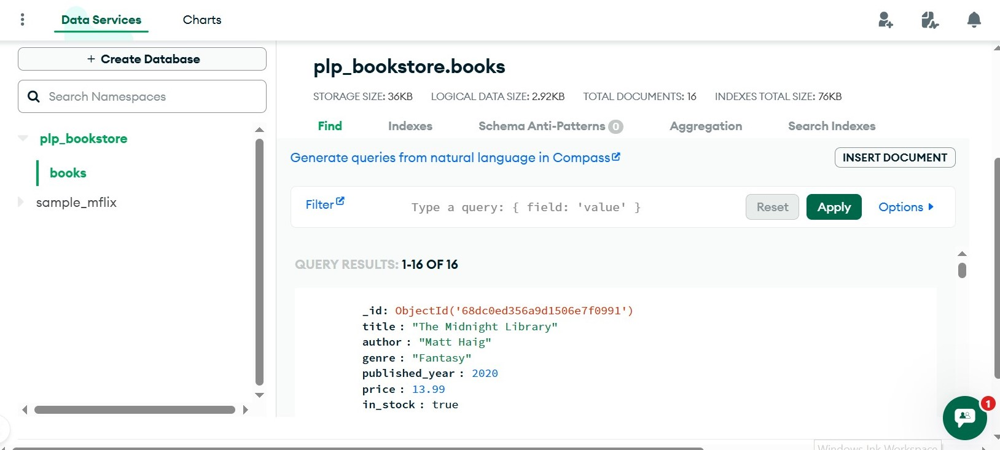

# MongoDB Fundamentals - Week 1

This project demonstrates how to interact with a MongoDB Atlas database using Node.js, without using Mongoose. It covers:

- Inserting sample data

- Running various queries

- Using aggregation pipelines

- Creating indexes

- Pagination and projections

- Using .explain() to analyze performance

### 🛠️ Tech Stack

Node.js

MongoDB Atlas (cloud database)

MongoDB Native Driver

dotenv (.env file for credentials)

### Run the project

node queries.js

It will:

Connect to your MongoDB Atlas cluster

Insert sample books

Run queries (filter, update, delete)

Perform aggregations

Create indexes and demonstrate their performance

### 🔍 Basic Queries

- Find by genre, author, or year

- Update and delete documents

### 📊 Aggregations

- Average price by genre

- Top author by book count

- Books grouped by decade

### ⚡ Indexing

- Index on title

- Compound index on author + published_year

- .explain() usage for performance

### 📄 Pagination

- Skip/limit (5 books per page)

- Sort by price

- Return only needed fields (projection)

### 🧠 Learning Goals

- Understand the structure and querying power of MongoDB

- Learn how to use the MongoDB native driver (without Mongoose)

- Practice using indexes, aggregations, and projections

- Build confidence reading .explain() results

### 📌 Future Ideas

- Add CLI prompts (e.g. inquirer) to run custom queries

- Expose this as an Express REST API

- Connect to a frontend for browsing the bookstore
